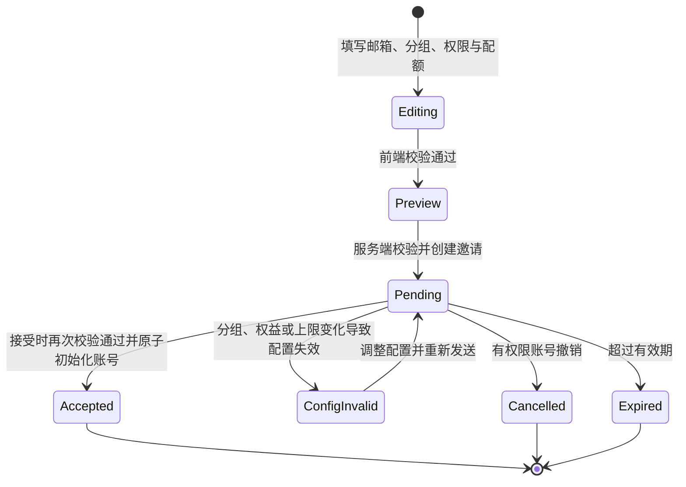

# 账号权限、协作和配额管理 Spec v0

> 状态：historical / superseded，已冻结，不得用于研发、验收或继续补写模块动作矩阵。
> 需求输入：`input_v0.md`。
> 现状证据：`fact_check_v0.md`。
> 创建日期：2026-07-23。
> 失效原因：本文基于旧 `T1-T2-T3 + 唯一主组/隐藏分组 + 项目跟随 Owner + Owner/Editor/Viewer` 根模型；当前 Input 已改为「组织身份与组内身份解耦 + 多组成员 + 单组项目 + 全局组身份切换 + Owner/Collaborator」。只读访问现按查看范围或显式查看授权表达，不再设置 Viewer/Editor 协作者等级。

> **当前生效基线**：以 `input_v0.md` 第 5 节、第 7.3 节和第 9.3 节，以及 `账号和权限功能设计梳理.md` 为准。本文以下正文仅保留历史设计轨迹；进入 Spec 阶段时应从当前 Input 重新生成，不在本文件上继续增量修补。

## 1. Spec 目标

本 Spec 将 Input 中已确认的 P0/P1 规则转换为可实现的实体、字段、权限计算顺序、接口契约、迁移方案和验收用例。

本版本不是建设通用权限中台。实现必须围绕现有组织关系、分组、子账号页、数据管理页、配额页和五类业务对象增量展开：

- 邮件项目
- 网红资源夹/收藏夹
- 内容监控项目
- CRM 记录
- 跨境支付单/草稿

## 2. 设计原则

1. **身份、功能、范围、对象授权、配额分层**：账号等级不携带模块权限或配额数量。
2. **后端最终鉴权**：前端隐藏或禁用只是交互提示，服务端必须对读写接口逐项校验。
3. **多重授权取最高，硬限制先拦截**：Owner、显式 ACL、T1/T2 范围策略可叠加；账号停用、模块禁用、套餐限制不能被任何业务授权绕过。
4. **项目跟随 Owner，不绑定分组**：项目的组范围由当前 Owner 主分组动态派生。
5. **创建人与 Owner 分离**：创建人是不可变历史字段；Owner 是可经标准流程变化的责任主体。
6. **管理动作与业务动作分离**：能管理组织成员不等于能删除业务对象；能编辑对象不等于能管理协作者或执行支付。
7. **兼容优先**：CRM 四项线上权限、邮件协作关系、资源夹范围和内容监控成员关系均须迁移，不得静默清空或收窄。

## 3. 核心实体

### 3.1 Organization

| 字段 | 类型 | 说明 |
| --- | --- | --- |
| `orgId` | id | 客户组织唯一标识；不继续用前端自行拼接的账号集合代替 |
| `ownerUid` | uid | 唯一组织所有者，组织内有且仅有一个 |
| `status` | enum | `active/suspended` |
| `planId` | id | 套餐与 Entitlement 来源 |
| `createdAt/updatedAt` | datetime | 审计字段 |

约束：

- `ownerUid` 必须是本组织有效成员。
- 组织所有者不能通过成员清退或角色修改接口删除。
- 本版本不提供“解散组织”。

### 3.2 OrganizationMember

| 字段 | 类型 | 说明 |
| --- | --- | --- |
| `orgId` | id | 所属组织 |
| `uid` | uid | 账号 |
| `accountLevel` | enum | `T1/T2/T3` |
| `isOrgOwner` | boolean | 是否唯一组织所有者；只有 T1 可为 true |
| `groupId` | id/null | T2/T3 的正式分组；null 由权限服务解释为隐藏分组 |
| `memberStatus` | enum | `invited/active/disabled/leaving/removed` |
| `activeTransferTaskId` | id/null | 成员正在转组或离职移交时的互斥锁；非空时禁止再次修改成员关系 |
| `joinedAt` | datetime | 加入时间 |
| `updatedBy/updatedAt` | uid/datetime | 最近修改人和时间 |

约束：

- T1 是组织级账号，不归属正式分组，`groupId=null`。
- T2/T3 只能有一个主分组；未分配正式分组的 T3 进入逻辑隐藏分组。
- 每个正式分组允许 `0..1` 个有效 T2。
- 隐藏分组不允许 T2，也不产生 Dashboard 分组汇总或支付同组自动 Viewer。
- 不再使用 `Boolean(adminStatus)` 判断权限。迁移映射候选：`1 -> T1`、`2 -> T2`、`0 -> T3`，组织所有者另由 `isOrgOwner` 标识。

### 3.3 OrganizationGroup

| 字段 | 类型 | 说明 |
| --- | --- | --- |
| `groupId` | id | 正式分组唯一标识 |
| `orgId` | id | 所属组织 |
| `groupName` | string | 分组名称，组织内唯一 |
| `leaderUid` | uid/null | 唯一 T2；允许为空 |
| `status` | enum | `active/archived` |
| `createdBy/createdAt` | uid/datetime | 创建审计 |

允许先创建空组，再添加成员或指定 T2。删除正式分组前必须把现有成员转入其他正式分组或隐藏分组；不自动删除成员或业务对象。

### 3.4 GroupCeiling

T1 为正式分组配置委派上限，不是横向角色模板。

| 字段 | 类型 | 说明 |
| --- | --- | --- |
| `groupId` | id | 正式分组 |
| `moduleKey` | enum | 顶级功能模块 |
| `moduleEnabled` | boolean | 该组账号最多可被开放到此模块 |
| `quotaMode` | enum | `limited/unlimited`；是否允许 unlimited 受套餐约束 |
| `quotaLimit` | number/null | 分组上限 |
| `updatedBy/updatedAt` | uid/datetime | 审计 |

隐藏分组不保存独立上限，动态继承组织模块上限和组织配额上限，由 T1 直接管理其中账号。

### 3.5 AccountGrant

每个账号直接配置具体模块和配额，不建设横向 Permission Set。

| 字段 | 类型 | 说明 |
| --- | --- | --- |
| `orgId/uid` | id/uid | 目标账号 |
| `moduleKey` | enum | 模块 |
| `moduleEnabled` | boolean | 模块可用性硬门禁 |
| `quotaMode` | enum | `capped/inherit` |
| `quotaLimit` | number/null | `capped` 时必填；`inherit` 时为空 |
| `updatedBy/updatedAt` | uid/datetime | 审计 |

规则：

- 组织所有者可配置任意子账号；非所有者 T1 可配置 T2/T3，但不能修改自己或其他 T1；任何操作都不能突破套餐/组织上限。
- T2 仅在组织委派开关开启后配置自己和本组 T3，且不能突破组上限。
- 邀请时必须显式提交模块与配额表单；初始值为模块全关闭、配额 `0`，邀请者可在确认前修改。
- 存量账号按当前有效能力无损初始化，不能套用新成员默认值。
- 跨境支付本期返回只读 `paymentFundMode=shared`，不设置账号支付金额上限。

### 3.6 OrganizationModulePolicy

| 字段 | 类型 | 说明 |
| --- | --- | --- |
| `orgId` | id | 组织 |
| `moduleKey` | enum | 模块 |
| `policyKey` | enum | 策略键 |
| `enabled/value` | boolean/json | 策略值 |
| `updatedBy/updatedAt` | uid/datetime | 审计 |

本期策略键至少包括：

- `t1_implicit_full_access`
- `t2_group_read`
- `t2_group_edit`
- `t2_can_manage_group_grants`
- `t2_can_invite_group_members`
- `t2_can_transfer_owner`
- `editor_can_be_granted_manage_collaborators`
- `default_collaborator_role`
- `payment_same_group_auto_viewer`
- `payment_same_group_view_sensitive`
- `members_can_view_team_quota`
- `monitor_only_t2_can_manage_label_definitions`

修改人规则：

- 两个 T2 委派开关和内容监控标签定义开关允许所有 T1 修改。
- 其余组织策略仅组织所有者修改，其他 T1 只读。
- 所有变更必须记录前后值、修改人、影响模块和生效时间。

### 3.7 BusinessObjectAuth

统一对象授权结构：

| 字段 | 类型 | 说明 |
| --- | --- | --- |
| `objectType/objectId` | enum/id | 对象类型和稳定实例 ID |
| `orgId` | id | 所属组织 |
| `creatorUid` | uid | 不可变创建人历史 |
| `ownerUid` | uid | 唯一当前 Owner |
| `aclVersion` | number | 乐观锁/缓存失效版本 |
| `updatedAt` | datetime | 最近授权变更时间 |

对象 ACL 明细：

| 字段 | 类型 | 说明 |
| --- | --- | --- |
| `objectType/objectId` | enum/id | 对象 |
| `memberUid` | uid | 显式协作者 |
| `role` | enum | `Viewer/Editor`；Owner 不重复写入 ACL |
| `canManageCollaborators` | boolean | 仅 Editor 可为 true |
| `canExecutePayment` | boolean | 仅支付对象 Editor 可为 true |
| `grantedBy/grantedAt` | uid/datetime | 授权审计 |

约束：

- Viewer 不能获得 `canManageCollaborators` 或 `canExecutePayment`。
- Owner/T1 可授予或收回 `canManageCollaborators`；获得该能力的 Editor 不得继续把能力授予他人。
- Owner 或当前模块准入有效的 T1 可向显式 Editor 授予或收回 `canExecutePayment`；Editor 即使已有该能力也不得为自己或他人授予、收回或继续委派。
- 普通 T2/T3 只能与当前 Owner 同主分组；T1 是组织级账号，可作为任一对象的显式协作者或 Owner。
- 隐藏分组成员之间允许显式协作，但不产生 T2 管理范围或自动 Viewer。

### 3.8 AuditEvent

| 字段 | 类型 | 说明 |
| --- | --- | --- |
| `eventId` | id | 事件 ID |
| `orgId` | id | 组织 |
| `actorUid` | uid | 实际操作人，从登录态取得 |
| `ownerUid` | uid/null | 操作发生时对象 Owner |
| `quotaAccountUid` | uid/null | 实际数据配额承担账号 |
| `fundingUid` | uid/null | 支付资金责任账号快照 |
| `targetType/targetId` | enum/id | 成员、策略、对象或任务 |
| `action` | enum | 动作 |
| `before/after` | json | 变更摘要，敏感字段脱敏 |
| `result/errorCode` | enum/string | 结果 |
| `occurredAt` | datetime | 时间 |

`getAccountLog` 仅作为存量邀请记录入口，不替代该事件模型。

### 3.9 TransferTask

| 字段 | 类型 | 说明 |
| --- | --- | --- |
| `transferTaskId` | id | 稳定任务 ID |
| `orgId/targetUid` | id/uid | 组织和目标成员 |
| `operationType` | enum | `change_group/remove_member` |
| `transferMode` | enum | `follow_member/transfer_all`；离职只允许后者 |
| `fromGroupId/toGroupId` | id/null | 转组信息 |
| `receiverUid` | uid/null | 全量移交接收人 |
| `status` | enum | `prechecking/ready/running/finalizing/rolling_back/succeeded/failed/recovery_required` |
| `attemptNo/configVersion` | number | 幂等重试轮次和任务配置版本 |
| `summary` | json | 各模块对象数、ACL 清理数、补权结果 |
| `failureCode/failureDetail` | string/json | 失败信息 |
| `createdBy/createdAt/finishedAt` | uid/datetime | 任务审计 |

成员关系变更必须在业务对象迁移成功后提交；任何模块失败时整体失败，不能展示“成员已离职但部分数据未处理”的中间成功。

## 4. 统一鉴权顺序

所有已接入模块使用同一判定顺序，模块可在动作矩阵中增加更严格条件，但不能跳过前置硬门禁。

```text
authorize(actorUid, moduleKey, action, objectType?, objectId?):
  1. 校验登录态、组织关系和 memberStatus=active
  2. 校验套餐 Entitlement、组织状态和账号 moduleEnabled
  3. 若访问具体对象，校验 object.orgId 与 actor.orgId 一致
  4. 校验对象生命周期是否允许 action
  5. 汇总有效授权来源并取最高业务角色
  6. 校验 action 所需角色或附加能力
  7. 若动作消耗数据配额，按 actorUid 逐层校验账号/组/组织上限
  8. 若动作形成支付资金承诺，校验组织钱包并写入 fundingUid=ownerUid 快照
  9. 执行动作并写 AuditEvent
```

### 4.1 有效业务角色合并

对具体对象收集以下来源：

1. `actorUid == ownerUid`：Owner。
2. 显式 ACL：Viewer 或 Editor。
3. T1 隐式策略开启：按模块动作矩阵获得范围 Editor/Viewer，但不自动获得删除等高风险动作。
4. T2 本组策略：对象 Owner 与 T2 同正式分组时获得范围 Viewer/Editor。
5. 跨境支付同组自动 Viewer：仅正式组普通成员，且组织开关开启。

取最高结果：`Owner > Editor > Viewer > None`。

附加能力不参与角色大小比较，分别按来源合并：

- `canManageCollaborators`
- `canExecutePayment`
- `canViewSensitivePaymentData`

显式 Editor 与隐式范围权限同时存在时，角色取高；附加能力只在各自明确来源存在时生效，不能因为角色取高而自动补齐。

### 4.2 硬门禁优先级

以下任一条件失败都直接拒绝，不再计算 Owner、T1/T2 或 ACL：

- 账号停用、离组、邀请未接受。
- 账号模块未启用。
- 组织套餐不包含模块。
- 对象不属于当前组织。
- 对象状态禁止该动作。
- 配额或组织钱包硬限制不足。

### 4.3 高风险动作

| 动作 | 默认允许主体 | 说明 |
| --- | --- | --- |
| 删除普通项目 | Owner；模块矩阵可额外允许显式 Editor | T1 隐式范围权限默认不包含删除 |
| 删除支付草稿 | Owner、显式 Editor | 已确认例外 |
| 取消/作废支付单 | 待支付动作矩阵确认 | 不能等同“删除” |
| 管理协作者 | Owner、T1、带 `canManageCollaborators` 的 Editor | Editor 不可继续授予该能力 |
| 主动转交 Owner | Owner/T1，且遵守同组规则 | 跨境支付详情不提供主动转交 |
| 支付提交/预约/放行 | Owner、命中跨境支付 T1 隐式策略的 T1、带 `canExecutePayment` 的 Editor | 实际 actor 记审计，资金责任归 Owner 快照 |
| 成员转组/清退移交 | T1 | 只通过 TransferTask |

## 5. 配额计算

本期采用“允许下级配置总和超过父级，实际消费逐层拦截”。

```text
checkQuota(actorUid, scopeId, amount):
  account = active account quota for actorUid
  group = actor formal group quota, or organization quota for hidden group
  organization = organization quota

  if account.mode == capped and account.remaining < amount: deny
  if group.remaining < amount: deny
  if organization.remaining < amount: deny
  otherwise allow and atomically consume against actorUid + parent levels
```

规则：

- `inherit` 表示“不设个人上限，使用所属分组共享额度”；隐藏组文案为“使用组织共享额度”。
- 真正的 `unlimited` 仅能来自套餐/组织父级无限。
- 数据额度消耗归实际操作人，不因其通过 Owner、角色范围或显式协作获得权限而改变。
- 每次消费审计同时记录 `actorUid/quotaAccountUid/objectId/scopeId/amount`。

当前邮件、资源夹和内容监控的真实扣额主体仍待 `fact_check_v0.md` BLOCKER-03 确认；若现状不是 actor，迁移方案需显式处理存量差异。

## 6. 存量迁移骨架

| 模块 | Owner 候选 | ACL 候选 | 必须避免的错误映射 | 阻塞项 |
| --- | --- | --- | --- | --- |
| 邮件项目 | 项目 `uid/creatorUid` | `members`、`canManageMembers` | 不把发件邮箱所有人当 Owner | 后端确认创建人字段和扣额主体 |
| 资源夹 | 后端创建人 UID；`myself` 仅作校验 | `scope/membersUid` | 不把“公开”直接映成全组织 Editor | 后端返回稳定创建人 UID |
| 内容监控 | `creator/creatorUid` 归一化 | `members/membersUid` | 不把 `responsibleUid` 当项目 Owner | `isMaster` 语义 |
| CRM | `ownerUser` | 新增 Viewer；旧四项迁动态 Editor 策略 | 不把 `viewAuthors` 当记录 Viewer | 16 组合真值和读范围 |
| 跨境支付 | 待后端回填创建人 | 本期新增 | 不用 `editFlag` 反推 Owner | 列表范围、创建人和执行权限真值 |

所有迁移脚本必须可重复执行、输出计数和异常清单，并在切流前后对同一测试账号集比较有效权限结果。

## 7. 进入模块动作矩阵前的阻塞项

详见 `fact_check_v0.md`：

1. CRM 四项写权限 16 种组合真值。
2. CRM 当前读范围。
3. 邮件、资源夹、内容监控的实际配额承担账号。
4. 支付单/草稿可见范围、Owner/执行人字段和 `editFlag` 真值。
5. 当前成员清退是否存在后端数据副作用。
6. 可复用审计能力是否存在。

阻塞项不妨碍评审本文件第 2-5 节，但在对应模块动作矩阵和迁移验收定稿前必须关闭。

## 8. 后续章节顺序

1. 账号邀请、成员配置与组织策略页面流程。
2. 分组、T2 委派和成员转组/离职数据移交状态机。
3. 通用对象 ACL 接口与协作者交互。
4. 邮件、资源夹、内容监控动作矩阵。
5. CRM 兼容迁移矩阵。
6. 跨境支付动作、敏感信息、执行权和资金责任矩阵。
7. 配额页面、批量增加额度和可见性。
8. P1 搜索、周期展示和标签定义管理。
9. 迁移、灰度、回滚和完整验收用例。

## 9. 账号邀请、成员配置与组织策略页面流程

### 9.1 页面与入口

本期保留现有三个子账号路由，不新增独立权限中心或团队动态中心：

| 现有入口 | 本期职责 | 增量改造 |
| --- | --- | --- |
| `/brand/sub-account` | 成员、邀请记录、分组 | 增加成员搜索、角色/分组筛选、“权限与配额”入口、分组管理入口；替换现有仅填写邮箱的邀请表单 |
| `/brand/sub-account/quota` | 用量与额度 | 保留账号额度表和现有配置入口；后续章节补充额度周期、可见性和批量增加额度 |
| `/brand/sub-account/data` | 组织级权限策略 | 保留现有路由，将 CRM、邮件等现有设置和新增模块策略按模块分区；页面最终名称和视觉分区留到 Design |

账号直接配置、分组上限和组织策略不能合并成一张表：三者的修改人、约束和生效范围不同，但可以从同一成员管理模块到达。

### 9.2 页面操作权限

| 操作人 | 成员页可见范围 | 可执行操作 |
| --- | --- | --- |
| 组织所有者 | 全组织 | 任免 T1；邀请 T3；管理所有正式分组、T2/T3、账号权限与配额；修改全部组织策略 |
| 非所有者 T1 | 全组织 | 邀请 T3；管理正式分组及 T2/T3；修改 T2/T3 的账号权限与配额；不能任免 T1，不能修改自己或其他 T1 的账号权限 |
| T2 | 本正式分组 | 默认只读；委派开关开启后可修改自己和本组 T3 的账号权限与配额；两个委派开关同时满足后可邀请 T3 到本组 |
| T3 | 无管理视图 | 不进入子账号管理页；仅在各模块内使用自己已有的功能和对象权限 |

补充约束：

- T2 始终不能清退成员、修改成员账号等级或调整成员分组。
- 组织所有者不通过本页被清退或降级。
- T1 管理成员是管理权限，不因此获得删除任意业务对象的权限。
- 成员停用、转组和清退触发的数据处理进入第 10 节独立状态机，不在普通账号配置提交中夹带执行。

### 9.3 邀请表单

现有批量邮箱输入继续保留；弹窗扩展为同一条连续流程，不引入分组默认模板。

| 表单区块 | T1 | T2 | 默认值与限制 |
| --- | --- | --- | --- |
| 邀请邮箱 | 可填写一个或多个 | 可填写一个或多个 | 去重；格式校验；待接受邀请和已入组账号需明确提示 |
| 目标分组 | 可选任一正式分组或“不选择分组” | 固定为本组且不可修改 | T1 不选时进入隐藏分组；所有目标账号初始均为 T3 |
| 功能模块 | 按组织权益和目标分组上限逐项设置 | 按本组上限逐项设置 | 全部默认关闭；没有组织权益或超出分组上限的模块禁用并说明原因 |
| 数据配额 | 为每个额度项选择个人上限 | 不超过本组额度上限 | 默认 `capped = 0`；可改为 `inherit` 或合法的 `capped` 数值 |
| 跨境支付额度 | 只读 | 只读 | 本期固定显示“不受个人支付额度限制，使用组织共享资金”，不提供数值输入 |
| 提交预览 | 查看并确认 | 查看并确认 | 展示目标分组、去重账号数、共同模块权限和共同配额摘要 |

批量邀请第一版对所有邮箱应用同一份权限与配额配置，不支持逐行设置。模块开关与数据配额相互独立：关闭模块不会删除已经配置的额度，但账号仍因模块硬限制而不能消费对应额度。

邀请者在最终确认前可以返回修改任一区块。前端预校验用于即时提示，服务端仍必须在提交时重新校验操作人权限、组织权益、目标分组、单个账号上限和剩余席位。

### 9.4 邀请状态与接受流程



规则：

1. 邀请记录必须保存 `targetGroupId`、共同账号初始化配置、邀请人和配置版本，不能只保存逗号拼接的邮箱字符串。
2. 待接受邀请继续占用席位；邀请前、提交时、接受时均复用现有服务端席位校验和 `40026` 明确提示。
3. 接受邀请时，成员关系、T3 等级、目标分组、模块权限和账号配额必须在同一事务内创建；任一初始化步骤失败不得留下“已入组但未配置”的半成品账号。
4. 接受时重新校验当前组织权益、分组是否存在、邀请配置是否仍不超过父级上限；失效时不静默降权或截断额度。
5. 配置失效后，原邀请人仍具备权限时可调整配置；否则由有权 T1 接管。保存新版本后重新发送，旧版本不可再接受。
6. 关闭 T2 邀请开关只阻止新建和修改邀请，不自动撤销已经发出的有效邀请；T1 可在邀请记录中主动撤销。接受时仍按当前组织、分组、席位和配置上限校验。
7. 其他引入成员的入口必须调用同一初始化契约，不能绕过显式模块和配额配置。

### 9.5 邀请服务契约

接口命名留给技术设计，服务端至少提供以下三个语义操作：

```text
prepareMemberInvites(actorUid, emails, targetGroupId)
createMemberInvites(actorUid, emails, targetGroupId, moduleGrants, quotaGrants, idempotencyKey)
acceptMemberInvite(inviteToken, expectedConfigVersion)
```

`createMemberInvites` 的核心请求结构：

```json
{
  "emails": ["member-a@example.com", "member-b@example.com"],
  "targetGroupId": "group-id-or-null-for-hidden",
  "initialLevel": "T3",
  "moduleGrants": [
    { "moduleKey": "crm", "enabled": true },
    { "moduleKey": "cross_border_payment", "enabled": false }
  ],
  "quotaGrants": [
    { "quotaKey": "example_data_quota", "mode": "capped", "limit": 0 }
  ],
  "paymentQuotaMode": "organization_shared_unlimited",
  "idempotencyKey": "client-generated-key"
}
```

服务端不得信任客户端传入的 `initialLevel`、目标分组或上限，必须按当前操作人重新推导允许范围。旧的仅邮箱邀请调用在新流程上线后只能兼容历史待处理请求，不能继续创建缺少初始化配置的新邀请。

### 9.6 已入组成员的“权限与配额”

成员行新增统一入口，打开账号配置抽屉或弹窗；具体容器和布局由 Design 决定。表单至少包含：

- 只读身份摘要：账号、状态、账号等级、正式分组或“未分组”。
- 顶级功能模块开关：仅展示组织套餐包含或可申请开通的模块；缺少组织权益时提供明确原因和快捷申请开通入口。
- 数据配额：每个额度项选择 `inherit` 或 `capped`；`inherit` 在正式分组下显示“使用分组共享额度”，在隐藏分组下显示“使用组织共享额度”。
- 跨境支付额度：本期锁定为组织共享、不受个人支付额度限制，只展示说明，不允许修改。
- 当前约束摘要：组织权益、正式分组上限或隐藏分组的组织上限。

保存规则：

1. 账号模块权限和数据配额使用同一个配置版本提交，服务端原子保存；不能只保存其中一半。
2. 单个账号的 `capped` 上限不得超过当前父级上限；同组账号上限之和允许超过分组上限，实际消费时逐层拦截。
3. T2 编辑自己或本组 T3 时，每次提交都重新校验“T2 能否管理本组账号权限”和当前本组上限；“T2 能否邀请本组成员”不影响已入组成员配置。不能依赖打开弹窗时的旧权限。
4. 修改成功后展示模块和额度变更摘要，并写入审计日志；并发版本冲突时要求刷新，不覆盖其他管理员刚完成的修改。
5. 存量账号上线时保持现状映射出的有效能力，不套用“全关闭、额度 0”的新成员默认值。

### 9.7 分组管理

成员页增加分组管理入口；正式分组的配置对象包括组名、可选 T2、功能模块上限、数据配额上限和成员列表。

- 正式分组允许 `0..1` 名 T2，也允许没有成员的空组。
- T1 可以先创建空组，再配置上限、加入成员并任命 T2。
- 任命 T2 的候选人必须是该组内状态正常的 T3；任命后仍留在原组。移除 T2 后账号降为本组 T3。
- 已有 T2 的组再次任命时必须先明确替换，不能产生短暂的双 T2 状态。
- 删除正式分组前必须先移出全部成员并移除 T2；不能把成员静默转入隐藏分组。
- 隐藏分组不是可创建、改名或删除的正式组织实体，不出现在分组管理列表中；成员列表统一显示为“未分组”。
- 隐藏分组成员直接继承组织模块和配额上限，由 T1 逐账号配置；隐藏分组永远没有 T2。
- 项目不保存 `groupId`。Owner 转组后的业务范围变化由第 10 节状态机和统一权限计算处理，分组管理接口不能直接批量改写项目归属。

### 9.8 组织策略页

沿用 `/brand/sub-account/data`，按模块拆成独立配置区，避免新增一个与现有数据管理页竞争的权限中心。

| 配置区 | 主要内容 | 修改权限 |
| --- | --- | --- |
| 通用委派 | T2 能否管理本组账号权限；T2 能否邀请本组成员 | 所有 T1；邀请开关依赖管理开关 |
| 邮件/资源夹/内容监控 | T1/T2 范围策略、协作者管理策略、内容监控标签动作策略 | 除内容监控标签动作策略允许所有 T1 修改外，其余仅组织所有者修改 |
| CRM | 现有四项权限的等价迁移、记录级协作策略 | 仅组织所有者修改；迁移前不得改变现有四项组合语义 |
| 跨境支付 | T1 隐式权限、同组成员自动 Viewer、同组 Viewer 敏感信息、执行权限边界 | 仅组织所有者修改；敏感信息开关依赖自动 Viewer 开关 |
| 额度可见性 | 成员能否查看团队总体额度 | 仅组织所有者修改 |

交互和提交约束：

- 非所有者 T1 可以查看所有策略，但只有上表中的显式例外可编辑；T2/T3 不进入组织策略页。
- 关闭“T2 能否管理本组账号权限”时，同步关闭“T2 能否邀请本组成员”；后者不能单独开启。
- 关闭“同组成员自动成为 Viewer”时同步关闭“同组 Viewer 可查看敏感信息”，重新开启父项后子项保持关闭。
- 每个模块/区块独立保存并带配置版本，避免修改一个开关时覆盖其他模块的线上配置。
- 影响已有对象或现有管理权限的策略必须先展示影响摘要，再二次确认；保存后记录修改人、T1 身份、前后值和时间。
- CRM 现有配置值必须原样读回并迁移到新分区；在 `fact_check_v0.md` BLOCKER-01/02 关闭前，不实施 CRM 组合语义转换。

### 9.9 统一错误语义

前后端按稳定错误语义处理，不只依赖文案或页面隐藏：

| 错误语义 | 处理 |
| --- | --- |
| `ACTOR_NOT_ALLOWED` | 操作人无邀请或配置权限；保留已填表单并刷新权限状态 |
| `SEAT_LIMIT_REACHED` | 映射现有 `40026`；提示释放席位或升级套餐 |
| `TARGET_GROUP_INVALID` | 分组不存在、已删除，或 T2 目标不是本组 |
| `MODULE_OUT_OF_SCOPE` | 模块不在组织权益或分组上限内；定位到对应模块 |
| `QUOTA_OUT_OF_SCOPE` | 单账号额度超过当前父级上限；展示额度项和可用上限 |
| `CONFIG_VERSION_CONFLICT` | 配置已被其他管理员修改；刷新后重新确认 |
| `INVITE_CONFIG_INVALID` | 待接受邀请的分组、权益或上限已变化；阻止接受并通知邀请方调整 |
| `DUPLICATE_OR_EXISTING_MEMBER` | 邮箱已在组织内或已有有效邀请；在邮箱结果中单独标识 |

### 9.10 本节验收标准

1. T1 可以在现有成员页批量输入邮箱、选择正式分组或隐藏分组、填写一份共同模块和配额配置，并在确认后发出邀请。
2. 具备两个委派开关的 T2 只能邀请 T3 到本组，不能修改目标分组或超出本组上限；任一开关关闭后服务端立即阻止新邀请。
3. 新成员接受邀请后，不存在缺少模块或配额初始化的过渡状态；失败时不创建残缺成员关系。
4. 邀请提交和接受时席位已满，均复用现有 `40026` 明确提示；待接受邀请占位、撤销释放继续成立。
5. 组织所有者、非所有者 T1、T2 分别只能修改本节授权范围内的账号、分组和策略；直接调用接口不能越权。
6. 空组可创建；每个正式分组最多一个 T2；隐藏分组不可被任命 T2 或单独配置分组上限。
7. 账号配置同时保存模块权限和数据配额；失败时两者均不改变，成功后有变更摘要和审计记录。
8. 现有 CRM、邮件组织设置可以在组织策略页原值读取，不因页面重组丢失或重置。

### 9.11 已确认：批量邀请的失败粒度

采用“请求级错误整批失败，邮箱级错误允许部分成功”：

- 操作人越权、共同配置非法、目标分组非法或剩余席位不足以容纳全部有效邮箱时，整批不创建。
- 某个邮箱已经入组、已有有效邀请或服务端判定邮箱不可用时，只跳过该邮箱；其他邮箱正常创建邀请。
- 完成后展示成功、跳过、失败三类结果摘要，并支持复制失败邮箱。

该方案能保留批量效率，也不会在共同权限配置不成立时产生一批配置不一致的成员；代价是接口必须返回逐邮箱结果。备选方案是任一邮箱失败即整批失败，实现更简单，但用户需要反复清理名单重试。

确认结论：采用上述“请求级错误整批失败，邮箱级错误允许部分成功”的规则。

## 10. 成员转组、离职解绑与数据移交状态机

### 10.1 现有入口的增量改造

不新增资产盘点中心。现有成员页的两个动作改为进入统一移交流程：

| 现有动作 | 当前实现 | 本期变化 |
| --- | --- | --- |
| 修改成员分组 | 选择分组后直接调用成员关系接口 | 选择新组后先进入“数据跟随本人 / 全部数据移交”流程；任务成功后才修改成员关系 |
| 删除成员 | 确认后直接解除成员关系 | 改为“离职解绑”；必须选择接收人并完成全量数据移交后才能解除关系 |

只有 T1 可以发起。非所有者 T1 只能处理 T2/T3；非所有者 T1 的转组或离职解绑仅组织所有者可以操作；组织所有者不能使用本流程解除自己的组织关系。

### 10.2 流程输入

#### 成员转组

1. 选择目标正式分组或“未分组”。
2. 在以下结果中全局二选一：
   - `follow_member`：全部 Owner 型数据跟随本人，`owner_uid` 不变。
   - `transfer_all`：全部 Owner 型数据移交给同一个接收人。
3. `transfer_all` 时选择接收人；`follow_member` 不选择接收人。
4. 查看对象数量、ACL 清理、角色变化和补权摘要后确认。

转组不支持按模块或逐对象分别选择结果。若目标成员当前为 T2，任务成功时同步清除原组 `leaderUid`，成员以 T3 身份进入目标组；不会自动占用目标组 T2 名额，后续由 T1 单独任命。

#### 离职解绑

1. 只能选择 `transfer_all`。
2. 必须选择一个接收人。
3. 全部数据、ACL 处理和必要补权成功后，最后解除成员关系。
4. 不能选择“保留无 Owner 数据”“稍后处理”或按模块跳过。

### 10.3 接收人范围

接收人必须是组织内状态正常、已接受邀请且未处于其他移交任务中的账号，并满足以下范围：

| 原 Owner 范围 | 可选接收人 |
| --- | --- |
| 正式分组普通成员 | 同一正式分组的有效成员，或任一有效 T1 |
| 隐藏分组 T3 | 其他隐藏分组 T3，或任一有效 T1 |
| 非所有者 T1 | 其他有效 T1 |

补充约束：

- 普通成员不能跨正式分组接收数据；T1 作为操作者也不能绕过该限制。
- 接收人不能是目标成员本人、待接受邀请、已停用、正在离职或已经离组的账号。
- 接收人必须启用待接收对象覆盖的全部模块。
- 缺少账号模块权限时，预检查列出缺失项并允许 T1 显式选择“开通缺失模块并继续”。正式分组上限也缺失时，同一确认中同时提高分组模块上限和接收人账号权限。
- 快捷补权不能突破组织套餐或组织上限，不调整数据配额，不把“接收已有对象”计为一次新数据消费。
- 接收人为 T1 且缺少模块时，只有组织所有者可以快捷补权；非所有者 T1 不能借移交流程修改同级 T1 的账号权限。

### 10.4 移交对象注册表

首期只有显式注册到标准 Owner 移交适配器的对象参与：

| 模块 | 根对象 | 移交字段 | 不改写字段 |
| --- | --- | --- | --- |
| 邮件 | 邮件项目 | `owner_uid` | 创建人、发件账号、历史操作人 |
| 资源 | 网红资源夹/收藏夹 | `owner_uid` | 收藏明细创建事实、历史额度记录 |
| 内容监控 | 监控项目 | `owner_uid` | 监控结果、标签来源快照、历史操作人 |
| CRM | CRM 记录 | `owner_uid` | 跟进记录创建人、自定义视图创建人与分享关系 |
| 跨境支付 | 稳定 `orderId` 对应的草稿/支付单生命周期 | `owner_uid` | `created_by`、`fundingUid`、支付事件 actor、资金台账 |

注册规则：

- 覆盖进行中、完成、暂停、归档及可恢复软删除对象；永久删除且不可恢复的对象不处理。
- 只迁移根对象，明细、结果和跟进记录继续挂在根对象下。
- 组织/分组设置、账号权限与配额、标签定义及来源快照、频道历史收款账号、组织汇总数据不参与。
- 新模块不能因为存在 `creatorUid` 就自动进入移交；必须实现统一适配器并补齐验收用例。
- `fact_check_v0.md` BLOCKER-05 关闭前，不得假定现有删除成员接口已经处理任何上述对象。

### 10.5 Owner 与 ACL 结果

#### `transfer_all`

1. 接收人成为全部对象的新 Owner。
2. 接收人原有 Viewer/Editor ACL 删除，避免同时保存 Owner 和协作者身份。
3. 原 Owner 不自动降为 Editor，也不保留显式 ACL。
4. T1 及仍与新 Owner 同组的其他有效显式 Viewer/Editor 默认保留，其附加能力随原 ACL 保留。
5. 与新 Owner 跨组的普通成员 ACL 及其 `canManageCollaborators/canExecutePayment` 清除。
6. T1/T2 动态范围权限和支付同组 Viewer 不迁移，按新 Owner 和最新组织策略重新计算。

#### `follow_member`

1. `owner_uid` 不变，对象范围随成员目标分组重新计算。
2. T1 协作者以及转组后仍与 Owner 同组的普通协作者保留。
3. 原组中转组后与 Owner 跨组的普通成员 Viewer/Editor 及附加能力清除。
4. 转入隐藏分组时，只保留 T1 和同为隐藏分组成员的合法显式协作者；隐藏分组不产生 T2 范围或支付同组自动 Viewer。

提交预览必须按模块展示对象数、保留/清除的 Viewer 与 Editor 数量，并单独展示将保留或清除的高风险附加能力数量。T1 不接受清理结果时，只能取消操作或在转组场景改选 `transfer_all` 和合法接收人。

### 10.6 预检查

`precheckMemberTransfer` 生成带版本的不可变快照，至少校验：

1. 操作人、目标成员、目标分组和接收人资格。
2. 目标成员是否已有活跃任务，成员关系版本是否变化。
3. 每个注册模块的对象数量、状态和当前 Owner。
4. 接收人模块权限、分组上限和快捷补权可行性。
5. 将保留和清除的 ACL、附加能力数量。
6. 是否存在未注册的已知 Owner 型对象或模块适配器不可用。

存在阻断项时不创建执行任务。预检查结果超过有效期，或对象/成员/配置版本变化时，最终提交必须重新预检查，不能沿用旧摘要。

### 10.7 跨模块执行模型

本流程对用户只允许“全量成功”或“全量失败”，成员关系只能在所有对象处理成功后改变。由于当前尚未确认各模块是否共享数据库事务，采用协调器加模块适配器契约：

```text
discover(snapshot) -> validate -> stage -> finalize -> rollback
```

1. **锁定**：创建任务时在目标成员写入 `activeTransferTaskId`；禁止再次转组、离职、账号等级变化、Owner 主动变化和协作者变更。重复提交返回现有任务。
2. **发现与暂存**：各模块按预检查快照重新发现对象，保存 Owner/ACL 前值和待变更值；`stage` 不向正常业务读取暴露新 Owner。
3. **补权暂存**：必要的分组上限和账号模块补权与任务绑定，尚不对其他操作生效。
4. **最终提交**：进入 `finalizing` 后，各模块提交 Owner/ACL、新权限和成员关系变化；成员关系始终最后提交。
5. **失败回滚**：任一模块失败即进入 `rolling_back`，按快照恢复已经提交的 Owner、ACL 和补权，成员关系保持或恢复原值。
6. **解锁**：只有全部成功，或确认全部恢复到提交前状态后，才清除 `activeTransferTaskId`。
7. **异常兜底**：自动回滚未完成时进入内部 `recovery_required`，保持锁定、告警并由后端继续恢复；该状态不能对用户展示为“部分成功”或允许再次发起任务。

若后端确认全部对象和成员关系位于同一事务边界，可用单事务替代 `stage/finalize/rollback`，但不得改变以上外部结果和幂等规则。

模块适配器必须实现：

```text
discoverOwnedObjects(targetUid, snapshotVersion)
validateReceiver(receiverUid, objectSummary)
stageOwnerAndAclChanges(transferTaskId, beforeSnapshot, expectedVersions)
finalizeChanges(transferTaskId, attemptNo)
rollbackChanges(transferTaskId, attemptNo)
```

每一步按 `transferTaskId + attemptNo + moduleKey` 幂等；重试不能重复迁移已经成功处理的对象。

### 10.8 服务契约

```text
precheckMemberTransfer(actorUid, request)
createMemberTransferTask(actorUid, precheckToken, expectedConfigVersion, idempotencyKey)
getMemberTransferTask(actorUid, transferTaskId)
retryMemberTransferTask(actorUid, transferTaskId, expectedAttemptNo)
```

核心请求：

```json
{
  "targetUid": "member-uid",
  "operationType": "change_group",
  "toGroupId": "target-group-id-or-null",
  "transferMode": "transfer_all",
  "receiverUid": "receiver-uid",
  "enableMissingModules": ["crm", "cross_border_payment"],
  "expectedMemberVersion": 12,
  "idempotencyKey": "client-generated-key"
}
```

`remove_member` 时 `toGroupId=null`、`transferMode=transfer_all` 且 `receiverUid` 必填；`follow_member` 时 `receiverUid=null`。服务端必须重新推导全部范围，不能信任客户端提供的对象数量、ACL 数量或缺失模块。

### 10.9 摘要页与系统通知

任务提交后进入轻量摘要页，建议沿用成员管理路由层级，以稳定 `transferTaskId` 访问；不增加一级导航。页面只承载：

- 任务状态、操作类型、目标成员、原组和目标组。
- 数据跟随本人或接收人。
- 发起人、开始时间、完成时间和当前执行轮次。
- 各模块对象数、补权结果、保留/清除 ACL 与附加能力数量。
- 成功结果，或失败模块、错误原因和“重试”动作。
- 历史尝试摘要和最新结果，不展示逐对象资产列表。

任务进入 `succeeded` 或已完成回滚的 `failed` 时，向发起 T1 发送系统通知；同步完成也发送。通知包含目标成员、操作、结果和完成时间，并通过 `transferTaskId` 深链到摘要页。

通知按 `transferTaskId + attemptNo + finalStatus` 去重。失败后重试增加 `attemptNo`，仍复用同一摘要页和任务 ID。

### 10.10 锁定和错误语义

| 错误语义 | 处理 |
| --- | --- |
| `TRANSFER_TASK_EXISTS` | 返回已有任务和摘要页地址，不创建重复任务 |
| `MEMBER_VERSION_CONFLICT` | 成员、分组或角色已变化，要求重新预检查 |
| `RECEIVER_OUT_OF_SCOPE` | 接收人跨组、状态无效或不能接收 T1 数据 |
| `RECEIVER_MODULE_MISSING` | 展示缺失模块并进入显式补权确认；无法补权时阻断 |
| `TRANSFER_SNAPSHOT_STALE` | 对象数、Owner 或 ACL 已变化，重新生成摘要 |
| `TRANSFER_IN_PROGRESS` | 目标成员或对象正在最终提交，提示稍后重试 |
| `TRANSFER_ROLLED_BACK` | 本轮失败但已完整恢复，可在摘要页重试 |
| `TRANSFER_RECOVERY_REQUIRED` | 后端持续恢复并告警；前端只展示处理中，不允许继续操作 |

### 10.11 审计与验收

必须记录预检查确认、任务创建、锁定、快捷补权、每个模块的 Owner/ACL 前后值、成员关系变化、回滚、重试和终态通知。

验收标准：

1. 成员转组只能全局选择“全部跟随本人”或“全部移交”，离职只能全量移交给单一接收人。
2. 普通成员不能跨正式分组协作或接收 Owner；隐藏分组按隐藏范围判断；T1 可作为任一范围接收人。
3. 缺少模块时必须显式确认补权，不能静默开通；补权失败时不创建任务。
4. `follow_member` 清除转组后跨组的普通成员 ACL，`transfer_all` 清除原 Owner ACL 和新 Owner 的旧协作者记录。
5. 任一模块失败时，成员分组/组织关系不改变，Owner、ACL 和补权全部恢复；用户看不到部分成功终态。
6. 数据量较大转为后台执行时，摘要页可持续查看状态；成功和失败均只发送一次对应轮次通知。
7. 任务运行期间，重复转组、离职、角色修改、Owner 或 ACL 变化均被前后端阻止。
8. 支付单 Owner 移交不改写 `fundingUid`、支付 actor 或资金台账。
9. 可恢复软删除对象仍被移交，永久删除对象不处理；非 Owner 型共享数据保持不变。

### 10.12 已确认：任务执行期间的成员访问

按操作风险区分：

- **成员转组**：任务创建后，目标成员继续读取原分组范围，但暂时不能创建、编辑、执行支付、修改 Owner/ACL 或产生新额度消耗；任务成功后切换到新范围，失败并回滚后恢复原写权限。
- **离职解绑**：任务创建后立即将目标成员置为 `leaving`，禁止全部业务读写；只有任务完整回滚失败结果后才恢复原成员状态，成功后解除关系。
- **其他协作者**：在发现和暂存阶段继续使用对象；只在短暂 `finalizing/rolling_back` 窗口对受影响对象返回可重试的“数据移交处理中”，避免看到跨模块半提交状态。

这样可以防止快照生成后继续产生新对象或资金动作，同时把正常协作者的受影响时间限制在最终提交窗口。备选是任务全程冻结所有受影响对象，实现更简单但对大批量移交的业务中断更长。

确认结论：采用上述按转组、离职和其他协作者分别限制访问的方案。

## 11. 通用对象 ACL 与协作者交互

### 11.1 适用范围与不变量

通用 ACL 只服务已注册的具体业务对象，不建设模块级协作者名单：

| 对象类型 | ACL 主键粒度 |
| --- | --- |
| 邮件项目 | 单个邮件项目 ID |
| 网红资源夹/收藏夹 | 单个资源夹 ID |
| 内容效果监控 | 单个监控项目 ID |
| CRM | 单条 CRM 记录 ID |
| 跨境支付 | 稳定 `orderId`；草稿转正式单继续使用同一 ACL |

系统不变量：

1. 每个对象有且仅有一个 Owner；Owner 不重复写入 ACL。
2. 显式协作者只有 Viewer、Editor 两级；不增加共同 Owner 或账号级业务角色。
3. Owner、Editor、Viewer 定义不可由组织策略改变。
4. 普通成员不能跨主分组协作；T1 是组织级候选人，不受普通成员组范围限制。
5. 多来源普通角色取最高，硬限制先拦截；显式 Viewer 不会降低已有 T1/T2 范围 Editor。
6. 删除、Owner 转交、协作者管理、资金执行等高风险动作独立判断，不包含在普通 Editor 中。
7. 对象列表、Dashboard、详情、编辑和业务执行接口必须调用同一后端权限计算器。

### 11.2 对象创建

- 默认由服务端把实际创建人写为 `creatorUid` 和首任 `ownerUid`；客户端不能伪造创建人。
- `creatorUid` 永久不变，Owner 后续可按规则转交。
- 创建表单中选择的初始 Viewer/Editor 与对象、Owner 在同一事务内保存；失败时不产生缺少 Owner 或 ACL 半成品的对象。
- 模块如需支持“代他人创建”，必须在对应模块动作矩阵中单独定义；通用接口不默认开放客户端指定首任 Owner。
- 初始协作者等级使用该模块组织策略中的默认值预填，创建者可以在提交前逐人调整；默认值只影响新选择，不批量改写已有 ACL。

### 11.3 有效权限响应

权限服务针对 `actorUid + objectType + objectId` 返回统一上下文，业务前端不再分别从 `isMaster`、创建人、成员数组或账号等级自行拼权限：

```json
{
  "objectType": "email_project",
  "objectId": "project-id",
  "ownerUid": "owner-uid",
  "effectiveRole": "editor",
  "roleSources": ["explicit_acl", "t2_scope_policy"],
  "capabilities": {
    "canView": true,
    "canEdit": true,
    "canExecuteBusinessAction": true,
    "canManageCollaborators": false,
    "canGrantCollaboratorPrivileges": false,
    "canTransferOwner": false,
    "canDelete": false,
    "canExecutePayment": false,
    "canViewSensitivePaymentData": false
  },
  "hardRestrictions": [],
  "aclVersion": 8,
  "policyVersion": 3,
  "memberVersion": 12
}
```

`roleSources` 至少支持：

- `owner`
- `explicit_acl`
- `t1_implicit_policy`
- `t2_scope_policy`
- `crm_scope_policy`
- `payment_same_group_viewer`

前端只根据 `capabilities` 控制动作状态；后端写接口仍使用动作键再次鉴权，不能信任客户端回传的角色或能力。

### 11.4 角色与附加能力合并

普通角色按 `Owner > Editor > Viewer > None` 取最高。附加能力不按角色大小自动补齐：

| 能力 | 有效来源 | 不得推导出的能力 |
| --- | --- | --- |
| `canManageCollaborators` | Owner；命中 T1 隐式策略的 T1；组织策略允许且显式 Editor 标记为 true | 删除、Owner 转交、支付执行 |
| `canGrantCollaboratorPrivileges` | Owner；对当前对象已有有效访问的 T1 | 普通 Editor 即使能管理协作者也不能获得 |
| `canExecutePayment` | 支付 Owner；命中支付 T1 隐式策略的 T1；显式支付 Editor 标记为 true | 协作者管理、Owner 转交、资金归属 |
| `canViewSensitivePaymentData` | 支付 Owner/Editor/T1；显式 Viewer；命中级联策略的同组动态 Viewer | 普通编辑、支付执行 |

补充规则：

- Viewer 永远不能持有 `canManageCollaborators` 或 `canExecutePayment`。
- Editor 降为 Viewer 或被移除时，服务端同时清除其所有附加能力。
- `canManageCollaborators` 和 `canExecutePayment` 互不推导。
- T1 隐式策略关闭后，未被显式授权的 T1 不再获得当前对象访问和治理能力；已有显式访问的 T1 仍可基于 T1 身份授予或收回附加能力。
- 账号、套餐、模块或对象状态硬限制失败时，以上角色与能力均不生效，但 ACL 数据不会因此自动删除。

### 11.5 谁可以怎样管理协作者

| 操作人 | 可添加/移除 Viewer/Editor | 可调整 Viewer/Editor | 可授予/收回附加能力 | 可修改 Owner |
| --- | --- | --- | --- | --- |
| Owner | 是 | 是 | 是 | 仅按 Owner 转交规则 |
| 命中隐式策略或已有显式访问的 T1 | 是 | 是 | 是 | 除支付外按转交规则 |
| 带 `canManageCollaborators` 的 Editor | 是 | 是 | 否 | 否 |
| 普通 Editor、Viewer、T2 范围权限 | 否 | 否 | 否 | 仅 T2 单独命中转交策略时可转交 |

带 `canManageCollaborators` 的 Editor 还受以下限制：

- 不能修改 Owner。
- 不能授予、收回或改变任何人的 `canManageCollaborators/canExecutePayment`。
- 不能移除或降级仍持有任一附加能力的 Editor，因为该操作会间接收回附加能力；必须由 Owner/T1 先处理附加能力。
- 不能修改 T1 的显式 ACL；T1 授权由 Owner/T1 管理。
- 可以添加普通 Viewer/Editor、在两者间切换或移除普通协作者；新增 Editor 的附加能力固定为 false。

这些限制由后端按变更前后差异判断，不能只依靠前端隐藏开关。

### 11.6 候选人搜索与模块补权

协作者选择器按昵称或邮箱服务端搜索，不一次性下发全组织账号。候选范围：

| 当前 Owner | 普通成员候选 | T1 候选 |
| --- | --- | --- |
| 正式分组 T2/T3 | 同一正式分组的有效 T2/T3 | 全部有效 T1 |
| 隐藏分组 T3 | 其他隐藏分组有效 T3 | 全部有效 T1 |
| T1 | 见 11.13 待确认项 | 其他有效 T1 |

候选接口需返回：账号标识、昵称、邮箱、T1/T2/T3、正式分组或未分组、账号状态、模块是否启用、不可选原因和是否允许快捷补权。

- 待接受邀请、停用、离职中、已离组账号不可选。
- 账号缺少当前模块时仍可出现在搜索结果中，但默认不可选并说明原因。
- 当前操作人同时具有对应账号权限管理权，且补权不突破套餐和分组上限时，可以显式确认“开通该成员的模块权限并添加”。
- 分组上限也缺失时，只有有权修改分组上限的 T1 可以同时提高分组上限；Owner 或 Editor 仅有对象治理权时不能修改账号权限。
- 快捷补权与 ACL 变更使用同一提交事务或同一可回滚任务；ACL 添加失败时不能留下单独补开的模块权限。
- 缺少组织套餐权益时提供申请开通入口，不允许 ACL 绕过。

### 11.7 协作者列表交互

各模块复用同一交互语义，视觉组件可在 Design 阶段适配现有页面：

1. Owner 单独展示，不混入可删除的协作者列表。
2. 列表只展示当前对象显式 Viewer/Editor，不把 T1/T2/CRM 范围账号批量写入或展示成显式成员。
3. 列表顶部展示权限来源说明：`根据组织权限设置，主账号和超级管理员无需加入协作者，也可能拥有该对象的查看、编辑及协作者管理权限。`
4. 每个显式协作者展示账号、组、Viewer/Editor、附加能力和账号失效状态。
5. 角色使用 Viewer/Editor 单选；只有 Owner/T1 编辑显式 Editor 时显示可用的附加能力开关。
6. 组织未开启“允许 Editor 管理协作者”时，不展示 `canManageCollaborators` 授权入口。
7. 保存前展示新增、移除、升降级、快捷补权和附加能力变化摘要。
8. 没有管理权限的用户可查看协作者摘要，但不展示保存入口；是否允许 Viewer 查看完整成员邮箱由现有隐私规则决定，通用 ACL 不额外扩大个人信息可见性。

### 11.8 ACL 变更接口

ACL 使用差量操作和乐观锁，不让不同管理员提交整张旧列表互相覆盖：

```text
searchEligibleCollaborators(actorUid, objectType, objectId, keyword, cursor)
getObjectAccessContext(actorUid, objectType, objectId)
getExplicitCollaborators(actorUid, objectType, objectId)
applyObjectAclChanges(actorUid, objectType, objectId, expectedAclVersion, operations, idempotencyKey)
```

变更请求示例：

```json
{
  "expectedAclVersion": 8,
  "operations": [
    { "op": "add", "memberUid": "u-1", "role": "viewer" },
    { "op": "update", "memberUid": "u-2", "role": "editor" },
    {
      "op": "set_capabilities",
      "memberUid": "u-2",
      "canManageCollaborators": true,
      "canExecutePayment": false
    },
    { "op": "remove", "memberUid": "u-3" }
  ],
  "enableMissingModules": ["u-1"],
  "idempotencyKey": "client-generated-key"
}
```

整批变更必须原子校验和保存：任一成员跨组、状态失效、模块补权失败、操作人越权或 `aclVersion` 冲突时，ACL 和快捷补权均不改变。成功后 `aclVersion + 1`，失效对象详情和列表权限缓存，并返回实际结果摘要。

### 11.9 Owner 主动转交

跨境支付不提供对象详情内的主动转交，其他对象使用统一语义接口：

```text
transferObjectOwner(actorUid, objectType, objectId, newOwnerUid, expectedAclVersion, idempotencyKey)
```

允许主体：

- 当前 Owner。
- 对当前对象有有效访问的 T1。
- 组织所有者开启该模块“T2 可转交本组负责人”，且 T2 同时拥有当前对象有效编辑权限时的本组 T2。

接收人必须状态正常、启用当前模块，并满足与 11.6 相同的协作范围。转交时原子执行：

1. 更新唯一 `ownerUid`。
2. 删除新 Owner 原有显式 ACL。
3. 原 Owner 不自动变为 Editor；只有另行明确授权时才保留。
4. 重新校验并清理不再同组的普通成员 ACL 及附加能力。
5. `creatorUid`、历史 actor、配额消耗和支付责任字段不改变。
6. 增加 `aclVersion` 并记录转交前后 Owner、ACL 清理和操作人。

### 11.10 组织策略变化

- T1 隐式策略开启/关闭通过 `policyVersion` 实时生效，不批量写入或删除对象 ACL。
- “允许 Editor 管理协作者”关闭后，已保存的 `canManageCollaborators=true` 立即停止生效但保留记录；重新开启后恢复，避免全量改写对象。策略页面必须在确认时说明恢复语义和影响对象数量。
- 模块默认协作者等级变化只影响之后新选择的协作者，不改写已有 Viewer/Editor。
- T2 范围策略、CRM 范围策略和支付同组 Viewer 同样只改变动态来源，不创建或删除显式 ACL。
- 任一策略变化都必须使列表、详情、Dashboard 和动作接口的权限缓存同时失效。

### 11.11 错误语义

| 错误语义 | 处理 |
| --- | --- |
| `OBJECT_ACCESS_DENIED` | 当前对象无有效访问；不泄露对象详情 |
| `ACL_MANAGE_DENIED` | 无协作者管理权限，或试图修改受保护协作者/能力 |
| `COLLABORATOR_OUT_OF_SCOPE` | 普通成员与 Owner 跨组，或 T1 Owner 场景不满足最终规则 |
| `COLLABORATOR_MODULE_MISSING` | 模块未启用；返回是否可快捷补权 |
| `ACL_VERSION_CONFLICT` | ACL 已变化；刷新列表和差异后重新确认 |
| `OWNER_TRANSFER_DENIED` | 操作人、对象类型或接收人不满足转交规则 |
| `OBJECT_TRANSFER_LOCKED` | 对象处于成员移交任务中；跳转对应摘要页或稍后重试 |

### 11.12 审计与验收

每次 ACL 和 Owner 变化记录对象、Owner、实际操作人、变更来源、成员角色/附加能力前后值、策略与 ACL 版本、快捷补权和结果。

验收标准：

1. 模块、列表和 Dashboard 不存在人工配置的模块级协作者名单；显式授权始终绑定具体对象。
2. 同一账号命中多个来源时角色取最高，附加能力按独立来源计算；硬限制不能被 ACL 绕过。
3. 带 `canManageCollaborators` 的 Editor 可以管理普通 Viewer/Editor，但不能传播或间接收回附加能力。
4. Viewer 不能执行写操作或持有附加能力；Editor 不因普通写权限获得删除、Owner 转交或支付执行。
5. 候选人搜索和后端写入同时阻止跨组普通成员；缺模块只能经有权账号显式补开。
6. T1/T2 动态范围账号不出现在显式列表；策略关闭后动态权限消失，显式 ACL 保留。
7. 并发 ACL 修改不会覆盖他人结果；整批 ACL 与快捷补权失败时不产生部分成功。
8. Owner 转交后创建人不变，新 Owner 不保留重复 ACL，原 Owner 不自动获得 Editor。
9. 邮件项目原 `canManageMembers=1` 可以迁移为 `canManageCollaborators=true`，但迁移后的 Editor 不能继续委派该能力。
10. 支付草稿和正式单使用同一 `orderId` ACL，状态转换不丢失 Owner、Viewer、Editor 或附加能力。

### 11.13 待确认决策：T1 作为 Owner 时的普通成员协作

T1 不属于任何正式组或隐藏分组，因此“普通协作者必须与 Owner 同组”在 T1 为 Owner 时没有自然候选人。要同时保持“项目不挂组”和“禁止跨组协作”，建议采用：

- T1 可以单独负责对象，也可以与其他 T1 显式协作。
- 需要 T2/T3 参与时，T1 先把 Owner 转交给目标正式组或隐藏分组中的一名成员，再由新 Owner 添加同范围协作者。
- 创建流程可把“转交负责人并添加协作者”做成一次连续确认，但底层仍先确定唯一 Owner，再按新 Owner 范围写 ACL。

备选方案是允许 T1 Owner 从任意组添加普通成员，但这实际上允许多个组通过 T1 在同一项目上协作，会破坏已确认的跨组硬限制；另一方案是给 T1 项目另选固定协作组，又会重新引入已否决的项目 `groupId`。
