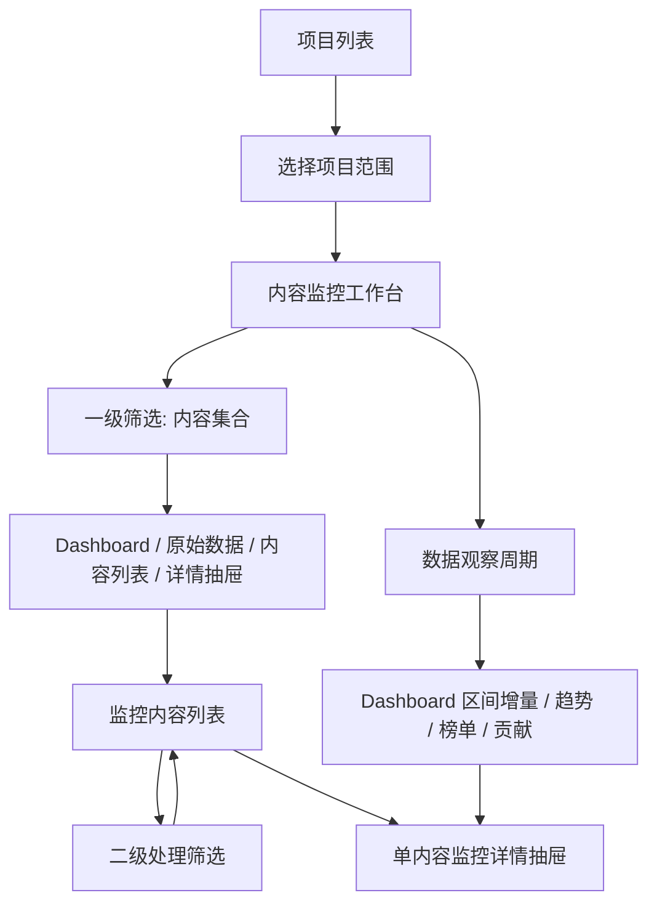

# PRD v1 · 内容监控 2.0 二期（v7.6.1）

> 阶段：PRD v1
> 上游：`input_v1.md`、`spec_v1.md`、`design_v1.md`、`feedback_analysis_v0.md`
> Demo：`06_Prototypes/monitor_761_layout_demos/index.html`
> 范围：WEB，Desktop First
> 状态：研发评审稿

---

## 1. Executive Summary

### 1.1 Problem Statement

v7.6.0 已完成内容监控创建链路重构，但创建后的结果解释能力仍不足。用户进入项目后，很难快速判断近期项目表现、哪些内容值得关注、数据为空或不可计算的原因，以及自动追踪新增内容是否需要处理。

同时，现有“项目列表 / 总监控列表”平级结构削弱了项目作为内容监控主容器的心智，老用户又已经形成直接查看全部内容的习惯，不能简单移除跨项目入口。

### 1.2 Proposed Solution

v7.6.1 将内容监控主结构收敛为：

```text
项目列表 -> 内容监控工作台
             ├─ 单项目范围
             ├─ 已选多项目范围
             └─ 全部可见项目范围
```

项目列表提供轻量近期速览；内容监控工作台承载数据看板、原始数据、监控内容列表和单内容监控详情抽屉；原总监控列表降级为 `全部可见项目范围` 的同一工作台。

### 1.3 Success Criteria

- 用户进入项目列表后，可以在不进入详情的情况下识别至少一类近期值得关注的项目：高观看、高互动、需关注内容或自动追踪新增。
- 用户进入内容监控工作台后，首屏可看到当前项目范围、一级筛选、数据看板入口和数据观察周期，且不会混淆“发布日期筛选”和“数据观察周期”。
- Dashboard 中所有默认指标都有明确公式、数据来源、不可计算状态和 tooltip 说明。
- 监控内容列表中的二级筛选只影响列表，不影响 Dashboard、原始数据和贡献分析。
- 单条内容点击后可以打开任务详情抽屉，并能查看配置、原始数据、趋势、评论、短链、预算和来源解释。
- 已归档项目不能新增监控或自动追踪新增，但历史数据、列表、详情抽屉和导出能力仍可查看。

---

## 2. User Experience & Functionality

### 2.1 User Personas

| 用户 | 目标 | 本期重点支持 |
| --- | --- | --- |
| PM / 项目主理人 | 快速理解项目近期状态，并能向内部或客户解释结果 | 数据看板、贡献分析、需关注提示、详情抽屉 |
| 投放运营 | 日常查看、筛选、补配置、处理异常和自动追踪新增内容 | 一级/二级筛选、内容列表、多选批量操作、快捷补短链/预算 |
| 客户成功 / 销售 | 消费 PM/运营整理出的结果，截图或转述项目状态 | 更清楚的 Dashboard、原始数据、任务详情解释 |
| 老用户 | 保留跨项目查看全部监控内容的习惯 | 全部可见项目范围、多项目工作台、旧入口迁移 |

### 2.2 Scope

#### Must

- 项目列表近期速览。
- 内容监控统一工作台。
- 单项目、已选多项目、全部可见项目三种项目范围。
- 工作台一级筛选、平台 Tab、搜索与数据观察周期的分层。
- Dashboard：观察区间概览、内容变化榜、关键指标趋势、达人/频道贡献。
- 原始数据块：延续线上可配置数据块，去掉独立 `自定义数据` 卡片。
- 监控内容列表：二级处理筛选、表头配置、多选批量操作、行点击打开详情抽屉。
- 单内容监控详情抽屉：配置、原始数据、趋势导出、评论、短链、预算、来源解释。
- 项目归档状态与确认流程。

#### Should

- 跨项目范围与旧总监控列表入口兼容。
- 项目列表顶部轻量概览。
- 表头配置保存为账号级配置。
- 未绑定短链、未填写预算的单元格快捷入口。

#### Backlog / TODO

- 评论抓取数量、覆盖平台、刷新频率提升。
- 独立报告系统、PDF/图片等报告生成器。
- 自定义标签交并集高级筛选。
- 自动追踪规则管理中心。
- 自动追踪新增结果的系统通知。
- 复杂异常检测算法、项目级 AI 总结。
- `效率指标观察`、`数据可信度`、`近期动向提醒` 的完整看板形态，需后续单独讨论。

### 2.3 User Stories & Acceptance Criteria

#### Story 1 · 项目列表近期速览

As a 投放运营, I want to scan all content monitoring projects quickly so that I can decide which projects need attention today.

Acceptance Criteria:

- 项目列表默认展示项目卡片，卡片整体可点击进入单项目工作台。
- 卡片展示最近 7 天观看量、最近 7 天互动率、需关注内容数。
- 卡片可辅助展示活跃内容数和自动追踪新增数。
- 项目列表顶部 `项目近期概览` 与下方卡片列表筛选互不影响。
- `项目近期概览` 默认展示 6 个数据块：观看增量、Engagement 增量、互动率、活跃内容、自动追踪新增、短链点击。
- `项目近期概览` 的日期范围是顶部概览自己的统计周期，默认最近 7 天；项目卡片仍使用固定最近 7 天速览。
- 观看增量按所选周期起止快照差值合计；Engagement 增量按点赞、评论、分享增量合计；互动率按 `Engagement 增量 / 观看增量` 计算；活跃内容按任一核心指标有正向变化的内容去重计数；自动追踪新增按任务来源和创建时间计数；短链点击优先按点击事件时间区间汇总。
- 顶部概览的变化值只表示与上一等长周期对比；当前或上一周期快照不完整时不展示变化值。
- 项目列表页所有筛选控件使用真实下拉控件。
- 项目卡片列表支持分页，分页不影响顶部概览数据。
- 多选状态默认不展示；点击 `多选项目` 后才显示勾选框、批量栏和 `查看已选项目内容`。
- 选中 0 个项目时，`查看已选项目内容` 禁用；选中至少 1 个项目时可进入多项目工作台。

#### Story 2 · 统一工作台与项目范围

As a PM, I want single-project and cross-project monitoring to use the same workbench structure so that I do not need to learn two different analysis pages.

Acceptance Criteria:

- 工作台 URL 支持 `projects=<projectId>`、`projects=<id1>,<id2>`、`projects=all`。
- 只有一个项目 ID 时展示单项目范围。
- 多个项目 ID 时展示已选多项目范围。
- `all` 表示全部可见项目范围，不能与项目 ID 混用。
- 当前范围展示在页面标题区，`添加监控`、`编辑范围` 和归档状态都属于当前范围卡片。
- 多项目和全部项目范围与单项目工作台复用 Dashboard、原始数据、内容列表、表头配置和任务详情抽屉。
- 多项目/全部项目范围的内容列表默认增加 `所属项目` 字段。
- 项目范围抽屉中，筛选项与项目列表页卡片筛选等价，并包含已选项目暂存区。

#### Story 3 · 一级筛选与数据观察周期

As a PM, I want to distinguish content collection filters from the data observation period so that dashboard numbers are interpretable.

Acceptance Criteria:

- 一级筛选决定当前内容集合，影响 Dashboard、原始数据、内容列表和任务详情抽屉。
- 一级筛选至少包括：监控状态、地区、视频标签、额外标签 1、额外标签 2、创建人、监控时长、观看量、视频类型、来源/自动追踪规则、发布日期。
- 视频类型筛选支持多选，选项为：youtube长视频、youtube短视频、tt视频、tt图片、ins posts、ins reels、x图文、x视频；无选中等价于全部类型，多个选项之间取并集。
- 平台 Tab 与频道名/标题/链接搜索属于一级筛选。
- 数据观察周期只控制 Dashboard 内的区间增量、趋势、榜单、贡献分析和任务详情趋势。
- 数据观察周期不进入一级筛选吸顶组，不影响监控内容列表字段和排序。
- 数据观察周期默认最近 7 天，支持最近 30 天、项目全周期、自定义。
- 若存在 `发布日期起点 publishStart`，则 `观察周期结束日期 observeEnd` 不能早于 `publishStart`。
- 若发布日期与观察周期部分不重合，Dashboard 标题区展示口径提示，而不是让用户在图表内猜原因。

#### Story 4 · Dashboard 观察区间概览

As a PM, I want the dashboard to summarize current state and action items so that I can quickly understand what changed and what needs attention.

Acceptance Criteria:

- Dashboard 第一块命名为 `观察区间概览`，不使用 `诊断`。
- `现状快照` 展示观看增量、Engagement 增量、互动率、活跃内容等只读指标。
- `待处理提示` 展示需关注内容、自动追踪新增、短链待处理、预算未填写、评论数据不足。
- 现状快照不作为下钻入口。
- 待处理提示可点击，并定位到监控内容列表，写入对应二级筛选。
- 写入二级筛选后，不改变 Dashboard、原始数据和贡献分析统计口径。
- 每个需要说明的数据项右上角展示 `?` tooltip。
- tooltip 文案与 `spec_v1.md` 中定义一致，不能只存在于 Demo。

#### Story 5 · Dashboard 内容变化与贡献分析

As a PM, I want to identify high-change content and contributing channels so that I can explain what drove the project state.

Acceptance Criteria:

- 内容变化榜默认按观察区间观看增量排序。
- 内容变化榜支持切换观看增量、Engagement、点赞、评论、分享、ER 等指标。
- Engagement 榜单行内分列展示点赞、评论、分享，ER 作为综合效率指标，不替代 Engagement 子项。
- 点击内容变化榜单条内容，打开单内容监控详情抽屉。
- 关键指标趋势默认展示观看量和 Engagement，支持点赞、评论、分享、短链点击等指标切换。
- 达人/频道贡献模块默认按观看增量展示贡献占比。
- 达人/频道贡献支持切换观看增量、Engagement、短链点击、内容数。
- 达人/频道贡献指标切换只影响模块自身，不改变全局筛选、列表筛选或列表排序。
- 标签贡献分析支持 `观察期增量 / 当前累计值` 两种模式。
- 标签贡献分析支持观看、Engagement、点赞、评论、分享、短链点击、内容数切换。
- 标签贡献分析的模式和指标切换只影响本模块，不改变全局筛选、列表筛选或列表排序。
- 标签贡献分析的指标切换同时控制图表排序和全量明细表排序，当前排序列需要在表头中标记。
- `内容数` 在观察期增量模式下表示观察期活跃内容数，在当前累计值模式下表示标签内容总数。
- 标签图表页面展示可使用 TOP 20 + 其它，XLSX 导出必须包含全部标签明细。
- 平台切片模块不作为当前 Dashboard 主展示。

#### Story 5.1 · XLSX 数据导出

As a PM, I want to export the current dashboard and task data separately so that I can share data with internal teammates without forcing them to read the online page.

Acceptance Criteria:

- 保留全页面级别导出：未经筛选的全部监控任务表格数据 + 原始聚合数据。
- 新增数据看板导出：当前筛选视图下的 Dashboard 数据，包含观察区间概览、内容变化榜、达人/频道贡献、标签贡献和趋势数据。
- 新增当前视图导出：当前筛选视图下的监控任务表格 + 原始数据。
- 导出沿用既有 `.xlsx` 格式，本期适配多 sheet 和多类导出范围。
- 导出文件内必须包含 `README` sheet，说明项目范围、筛选范围、数据观察周期和导出口径。
- 看板导出中的标签贡献数据不按页面 TOP 20 截断，输出全部标签。

#### Story 6 · 原始数据块

As a user, I want raw metric blocks to stay close to the content list so that I can compare configured metrics with the actual monitored content.

Acceptance Criteria:

- 原始数据块是与 `数据看板`、`监控内容` 同级的独立区块。
- 原始数据块位于 Dashboard 与监控内容列表之间。
- 展示方式保持线上平铺数据块，不按指标类别分组。
- `配置数据块` 入口放在原始数据块标题区。
- 配置抽屉必选项为观看量、点赞数、评论数、分享数、互动率；必选项不可隐藏，不参与拖拽排序。
- 原始数据块不再展示独立 `自定义数据` 指标卡。
- 配置抽屉中也不展示 `自定义数据` 配置项。
- 预算、CPM、CPV、CTR 等数据项必须通过 tooltip 说明依赖手动输入或配置数据。

#### Story 7 · 监控内容列表

As a 投放运营, I want the content list to support processing-oriented filters and batch actions so that I can quickly handle problematic tasks.

Acceptance Criteria:

- 监控内容列表不再保留第二个 `趋势` Tab。
- 列表继承项目范围和一级筛选上下文。
- 二级筛选只影响下方内容列表，不影响 Dashboard、原始数据和贡献分析。
- 二级筛选至少包括：数据问题、短链状态、预算状态、评论状态、近期新增。
- 二级筛选使用真实 select，并展示完整候选项。
- 清空列表筛选只清空二级筛选。
- 列表排序由表头控制，不在二级筛选中提供排序项。
- 列表默认展示内容、观看量、近期观看量趋势、点赞数、评论数、分享数、互动率、进度、Nox 短链点击、预算消耗、来源、新增时间。
- `近期观看量趋势` 是 inline graph，仅用于扫描，不作为筛选或排序口径。
- 不新增独立 `处理状态`、`监控状态`、`增长状态` 列；状态解释合并到评论数、短链点击、预算消耗、新增时间等事实字段。
- 未绑定短链展示 `绑定` 快捷入口；未填写预算展示 `填写` 快捷入口；点击后打开单内容监控详情抽屉。
- 列表行点击打开单内容监控详情抽屉。
- 列表支持多选，批量操作包括移动到其他项目、打标签、修改任务归属人（仅当后端确认存在任务级字段）、修改监控时长、导出、删除。

#### Story 8 · 表头配置

As an operator, I want to configure which table columns I see so that the list matches my daily processing needs.

Acceptance Criteria:

- 表头配置入口位于表头末尾，以齿轮 icon 展示。
- 点击后打开右侧抽屉。
- 抽屉中展示真实字段池，而不是只展示当前默认表头。
- 每个字段有开关；可显示/隐藏字段。
- 字段支持拖动排序。
- `内容` 列永远置顶且不可隐藏。
- 配置保存为账号级配置。

#### Story 9 · 单内容监控详情抽屉

As a user, I want a single task drawer to explain one monitored content item fully so that I can inspect and quickly fix missing configuration.

Acceptance Criteria:

- 单条内容行、Dashboard 内容榜单都打开同一套单内容监控详情抽屉。
- 抽屉顶部展示内容信息、平台、标题、创作者、发布时间和操作入口。
- 监控配置区展示所属项目、项目创建人/协作者、任务归属人（仅当后端确认存在任务级字段）、监控时长、合作视频/贴文链接、视频标签、额外标签 1/2、Nox 短链、预算/成本、备注、来源规则。
- 预算/成本字段可填写，默认未填写。
- 数据总览继承工作台原始数据块配置，不在抽屉内维护第二套配置。
- 数据趋势展示观看、点赞、评论、Nox 短链点击等趋势。
- 数据趋势支持图表/列表切换、日期范围选择和 `导出数据`。
- 趋势导出只导出当前单条任务、当前日期范围、当前选中指标。
- 评论情感分析、评论高频词、短链点击分布在无数据时保留模块并展示空态原因。
- 自动追踪来源只展示来源和规则名，不展开规则管理。

#### Story 10 · 自动追踪新增通知（TODO）

自动追踪新增结果的系统通知本期未实现，移入 Backlog / TODO。本期仅保留自动追踪来源解释、规则名展示，以及通过待处理提示或列表筛选查看自动追踪新增任务。

后续如重新进入版本，需另行补充通知候选事件、每小时聚合频控、权限过滤、deep link、任务去重和异常处理。

#### Story 11 · 项目归档

As a PM, I want to archive inactive projects so that they leave daily operation views without losing historical data.

Acceptance Criteria:

- 归档不等于删除，也不强制停止项目内已存在监控任务。
- 归档入口包括项目列表运行中项目卡片的 `归档`，以及单项目工作台当前范围卡片的 `归档项目`。
- 点击归档后必须弹出确认层，不直接改状态。
- 确认层展示被归档项目名称。
- 确认层说明：项目从默认项目列表退出、添加监控暂停、自动追踪新增暂停、已存在任务继续更新到原监控结束时间。
- 点击取消、遮罩关闭或关闭弹层，不改变项目状态。
- 点击确认后，项目状态变为 `已归档`。
- 已归档项目仍可进入工作台查看历史数据。
- 已归档项目的 `添加监控` 禁用，并说明原因。
- 已归档项目不再通过自动追踪新增监控任务。
- 取消归档后项目回到运行中；自动追踪规则是否恢复生效按规则自身状态判断。

### 2.4 Non-Goals

- 不重构新建监控链路。
- 不建设自动追踪规则管理中心。
- 不提升评论抓取能力。
- 不建设独立报告系统。
- 不承诺 PDF、图片等报告型导出；本期仅沿用数据型 XLSX 导出并扩展导出范围。
- 不建设复杂异常检测算法。
- 不新增项目级 AI 总结。
- 不接入新平台或新内容形态。
- 不重构权限、配额、删除和导出体系。

---

## 3. AI System Requirements

本期不包含 AI 生成、AI 分析或 AI 自动总结能力。

若后续将 `项目级 AI 总结`、`评论代表性观点总结` 或 `报告生成器` 纳入范围，需要另开需求，并补充：

- 输入数据范围与权限边界。
- 生成内容可追溯性。
- 幻觉/误读防护。
- 人工确认与编辑机制。
- 质量评估集与验收标准。

---

## 4. Technical Specifications

### 4.1 Architecture Overview

#### 页面与路由

| 页面 | 路由建议 | 说明 |
| --- | --- | --- |
| 项目列表 | `/video-monitor/list` | 内容监控默认入口 |
| 内容监控工作台 | `/video-monitor/workbench?projects=<scope>` | 统一承载单项目、多项目、全部项目 |
| 旧总监控列表 | `/video-monitor/monitor-list` | 迁移到工作台 `projects=all` 或保留弱入口跳转 |

#### 工作台项目范围 URL

| URL 参数 | 含义 |
| --- | --- |
| `projects=<projectId>` | 单项目范围 |
| `projects=<id1>,<id2>` | 已选多项目范围 |
| `projects=all` | 全部可见项目范围 |

`all` 是保留标记，不能与项目 ID 混用。

### 4.2 Data Flow



### 4.3 Filter Rules

| 层级 | 控件 | 作用范围 | 不影响 |
| --- | --- | --- | --- |
| 项目范围 | 当前范围卡片、项目范围抽屉、URL `projects` | 整个工作台 | 无 |
| 一级筛选 · 内容集合 | 状态、地区、标签、创建人、监控时长、观看量、视频类型、来源、发布日期 | Dashboard、原始数据、内容列表、详情抽屉 | 不定义统计时间窗口 |
| 一级筛选 · 平台/搜索 | 平台 Tab、频道名/标题/链接搜索 | Dashboard、原始数据、内容列表、详情抽屉 | 不作为列表二次搜索 |
| 统计口径 | 数据观察周期 | Dashboard 区间增量、趋势、榜单、贡献；任务详情趋势 | 不决定哪些内容进入集合，不改变列表字段 |
| 二级筛选 | 数据问题、短链状态、预算状态、评论状态、近期新增 | 监控内容列表 | Dashboard、原始数据、贡献分析 |

### 4.4 Metric Definitions

| 指标 | 公式/口径 | 不可计算状态 |
| --- | --- | --- |
| 观看增量 | 区间结束观看量 - 区间开始观看量 | 缺少基线点 |
| 点赞增量 | 区间结束点赞数 - 区间开始点赞数 | 缺少基线点 |
| 评论增量 | 区间结束评论数 - 区间开始评论数 | 缺少基线点 |
| 分享增量 | 区间结束分享数 - 区间开始分享数 | 缺少基线点 |
| Engagement 总量 | 点赞 + 评论 + 分享 | 任一字段缺失时按后端规则处理 |
| Engagement 增量 | 点赞增量 + 评论增量 + 分享增量 | 缺少基线点 |
| 互动率 | Engagement 总量 / 观看量 | 观看量为 0 或缺失 |
| 活跃内容数 | 观察区间内观看或互动有变化的内容数 | 缺少区间增量 |
| 内容贡献占比 | 单条内容观看增量 / 项目观看增量 | 项目观看增量为 0 |
| 达人/频道贡献占比 | 达人/频道观看增量 / 项目观看增量 | 项目观看增量为 0 |
| CPM | 成本 / 观看量 * 1000 | 成本未填写或观看量为 0 |
| CPV | 成本 / 观看量 | 成本未填写或观看量为 0 |
| CTR | 短链点击数 / 分母待确认 | 短链未绑定、点击缺失、分母未确认 |

### 4.5 Data Status

| 状态 | 含义 |
| --- | --- |
| normal | 数据可用 |
| empty | 当前范围无数据 |
| unfilled | 用户未填写 |
| not_configured | 未配置短链、标签等关联对象 |
| unsupported | 平台或内容类型不支持 |
| insufficient | 样本不足 |
| syncing | 同步中 |
| partial | 只有部分数据或缺基线 |
| failed | 获取失败 |
| unknown | 后端未给出明确原因 |

### 4.6 Integration Points

#### 前端

- 复用 `kol-next` 内容监控现有页面结构和组件风格。
- 项目列表、工作台、内容列表、任务详情抽屉应尽量复用现有筛选、表格、抽屉、图表和配置组件。
- 旧 `/video-monitor/monitor-list` 入口需要兼容到新工作台或弱化保留。

#### 后端 / API 待研发确认

| 编号 | 待确认问题 | 影响 |
| --- | --- | --- |
| B1 | 区间增量的基线选择和时间粒度 | Dashboard、列表、项目速览 |
| B2 | 项目、任务、达人/频道维度能否按筛选条件聚合 | Dashboard、贡献分析 |
| B3 | 任务列表是否返回区间增量字段，还是只返回累计值 | 列表、Dashboard |
| B4 | 多标签并集/交集、无标签筛选是否可由后端支持 | TODO，不阻塞本期主线 |
| B5 | 评论状态原因码是否存在 | 任务详情、列表状态 |
| B6 | 短链点击统计起点和同步状态字段 | 任务详情、CTR |
| B7 | 成本字段的字段名、单位、币种、编辑权限 | 预算、CPM、CPV |
| B8 | 项目列表是否可返回项目卡片固定最近 7 天速览指标 | 项目列表 |
| B9 | 项目列表顶部概览是否可按日期范围、项目范围、平台范围返回独立聚合指标 | 项目列表 |
| B10 | 跨项目视图是否支持项目 ID 多选过滤和区间增量 | 多项目工作台 |
| B11 | 现有全局列表控制台报错影响范围 | 旧入口迁移 |
| B14 | 项目归档状态是否已有字段；若没有，需新增项目生命周期状态 | 项目列表、工作台 |
| B15 | 是否存在任务级 owner/responsible user 字段；若不存在，761 不实现任务归属人展示或批量修改 | 内容列表、详情抽屉、批量操作 |

### 4.7 Security & Privacy

- 所有项目和任务数据必须遵循当前账号权限和可见范围。
- 多项目和全部项目范围只能聚合当前账号可见项目。
- 已删除、无权限或不可见任务被点击时，不展示任务详情数据，显示不可用提示。
- 归档不是删除；删除仍是独立高风险操作，不与归档混用。
- 批量删除、导出等沿用现有风险确认规则；本期不扩展高风险操作权限。

---

## 5. Risks & Roadmap

### 5.1 Phased Rollout

#### Phase 1 · 主结构与可见信息

- 项目列表速览。
- 统一工作台范围结构。
- 一级/二级筛选分层。
- 原始数据块独立。
- 内容列表字段、表头配置和行点击详情。
- 项目归档确认流程。

#### Phase 2 · Dashboard 与详情解释

- 观察区间概览。
- 内容变化榜。
- 关键指标趋势。
- 达人/频道贡献。
- 单内容监控详情抽屉增强。
- 趋势数据导出。

#### Phase 3 · 兼容迁移

- 旧总监控列表入口迁移到全部项目工作台。
- 多项目/全部项目范围边界验证。

### 5.2 Technical Risks

| 风险 | 说明 | 处理 |
| --- | --- | --- |
| 区间增量口径不稳定 | 后端可能只有累计值，缺少基线点 | 展示 partial 状态；缺少基线时不强行计算 |
| 项目速览聚合成本高 | 项目列表同时需要卡片固定 7 天速览和顶部概览动态聚合指标 | 若接口暂不支持，先降级展示可得指标；顶部概览不得用卡片当前页数据临时相加 |
| 日期口径混淆 | 发布日期与观察周期同时存在 | UI 分层、文案区分、无效日期联动拦截 |
| 评论原因码不足 | 后端无法区分无评论、未抓取、样本不足 | 第一版展示统一空态，不伪造原因 |
| 短链统计起点不明 | CTR/短链趋势解释可能误导 | tooltip 标注统计范围待确认 |
| 预算为手动数据 | 用户可能误以为系统采集失败 | 明确 `未填写`，不展示为采集异常 |
| 老用户入口迁移 | 原总监控列表使用习惯较强 | 保留全部项目入口和旧链接兼容 |
| 归档语义误解 | 用户可能以为归档会停止采集 | confirm 明确说明已存在任务继续更新 |

### 5.3 QA Checklist

- 项目列表卡片、筛选、分页、多选入口均可操作。
- 项目列表归档必须二次确认，取消不改状态，确认后进入已归档状态。
- `projects=<id>`、`projects=<id1>,<id2>`、`projects=all` 三类 URL 均能渲染正确范围。
- 一级筛选、平台 Tab、搜索影响 Dashboard、原始数据、列表和详情抽屉。
- 二级筛选只影响监控内容列表。
- 数据观察周期不改变列表字段，不生成观察区间增量列表列。
- 发布日期与观察周期无效组合被拦截或提示。
- Dashboard 现状快照不可点击；待处理提示点击写入二级筛选。
- 内容变化榜单条内容点击打开任务详情抽屉。
- 达人/频道贡献指标切换不影响全局筛选。
- 原始数据块不展示 `自定义数据` 卡片，配置抽屉不展示 `自定义数据` 项。
- 表头配置抽屉中 `内容` 列不可隐藏且固定置顶。
- 列表未绑定短链、未填写预算均有快捷入口并打开详情抽屉。
- 单内容趋势图可导出当前任务、当前时间范围、当前指标数据。
- 已归档项目禁用添加监控，不产生自动追踪新增。
- 项目级字段只出现创建人、协作者；PRD、Demo 和字段配置中不得出现项目负责人。
- 任务归属人/任务负责人相关展示或批量操作必须以后端确认任务级字段存在为前提。

### 5.4 Development Checklist

- 路由范围：实现并验证 `projects=<id>`、`projects=<id1>,<id2>`、`projects=all`；`all` 不与项目 ID 混用。
- 项目字段：项目层只使用创建人、协作者；不得新增项目负责人。
- 项目列表顶部概览：指标定义以 `spec_v1.md` 4.3 为准；后续新增、删除、重命名或修改计算公式时，必须同步更新 spec、design、PRD。
- 筛选分层：一级筛选影响 Dashboard、原始数据、内容列表、详情抽屉；二级筛选只影响内容列表；数据观察周期只影响 Dashboard 分析和任务详情趋势。
- 时间联动：存在 `publishStart` 时，禁止 `observeEnd < publishStart`。
- Dashboard：当前落地观察区间概览、内容变化榜、关键指标趋势、达人/频道贡献、标签贡献分析；效率指标观察、数据可信度、近期动向提醒不作为独立模块开发。
- 导出：沿用既有 XLSX 导出体系，适配全量导出、数据看板导出、当前视图导出三类范围；每个文件至少包含 README sheet 和对应数据 sheet。
- 原始数据：不展示独立 `自定义数据` 卡片，配置抽屉不展示 `自定义数据` 项。
- 内容列表：不新增默认处理状态、监控状态、增长状态总列；近期观看量趋势只做 inline graph。
- 表头配置：内容列必选置顶不可隐藏；字段池覆盖线上真实字段，保存为账号级配置。
- 详情抽屉：统一承接行点击、榜单单条点击；趋势图支持当前任务数据导出。
- 项目归档：归档必须二次确认；归档不删除、不停止已存在任务；归档后禁用新增监控和自动追踪新增。

### 5.5 Open Questions

- `效率指标观察`、`数据可信度`、`近期动向提醒` 最终是否合并为统一提醒体系。
- CTR 分母应使用短链点击 / 观看量、短链点击 / 曝光，还是其他口径。
- 短链点击统计起点是短链创建、绑定任务，还是监控任务创建。
- 评论状态原因码能否由后端稳定提供。
- 成本字段是否支持币种、日期、历史快照和权限控制。
- 是否存在任务级 owner/responsible user 字段；若不存在，任务归属人相关能力不进入本期。
- 旧 `/video-monitor/monitor-list` 是直接跳转还是保留弱入口壳。
